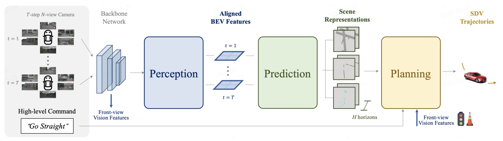

# ST-P3



> **ST-P3: End-to-end Vision-based Autonomous Driving via Spatial-Temporal Feature Learning**  
> Shengchao Hu, Li Chen, Penghao Wu, [Hongyang Li](https://lihongyang.info/), [Junchi Yan](https://thinklab.sjtu.edu.cn/), Dacheng Tao.       
> - [paper](https://arxiv.org/abs/), ECCV 2022
> - Our blog(Chinese) (coming soon)

## Introduction
This reposity is the official PyTorch Lightning implementation for **ST-P3**.

**TL;DR**: we propose a spatial-temporal feature learning scheme towards a set of more representative features for perception, prediction and planning tasks simultaneously in autonomous driving, and thus devise an **explicit** pipeline to generate planning trajectories directly from raw sensor inputs.

## Get Started
### Setup
```
conda env create -f environment.yml
git clone https://github.com/OpenPerceptionX/ST-P3.git
```

### Pre-trained models
- open-loop planning on nuScenes: [model]().
- closed-loop planning on CARLA: [model]().

### Evaluation
To evaluate the model on nuScenes:
- Download the [nuScenes](https://www.nuscenes.org/download) dataset.
- Download the pretrained weights.

```
bash scripts/eval_plan.sh ${checkpoint} ${dataroot}
```

To evaluate the model on CARLA:
- Please refer to the [Transfuser](https://github.com/autonomousvision/transfuser) to set up the environment.
- Test with the `carla_agent.py` file and the pretrained weights.


### Training

```
# (recommended) perception module pretrain
bash scripts/train_perceive.sh ${configs} ${dataroot}

# (optional) prediction module training purpose, no need for e2e training
bash scripts/train_prediction.sh ${configs} ${dataroot} ${pretrained}

# entire model e2e training
bash scripts/train_plan.sh ${configs} ${dataroot} ${pretrained}
```

- To train the model from scratch on nuScenes, we recommend to train a perceptual weight first and use it to train subsequent tasks to prevent `nan` during training. 
- If you would like to use the nuScenes depth data **(will be released very soon)**, change the data root in the config file.

## Benchmark
- Open-loop planning results on [nuScenes](https://github.com/nutonomy/nuscenes-devkit).

| Method    | L2 (m) 1s | L2 (m) 2s | L2 (m) 3s | Collision (%) 1s | Collision (%) 2s | Collision (%) 3s |
|:---------:|:---------:|:---------:|:---------:|:----------------:|:----------------:|:----------------:|
| Vanilla   | **0.50**  | **1.25**  | **2.80**  | 0.68             | 0.98             | 2.76             |
| NMP       | 0.61      | 1.44      | 3.18      | 0.66             | 0.90             | 2.34             |
| Freespace | 0.56      | 1.27      | 3.08      | 0.65             | 0.86             | 1.64             |
| **ST-P3** | 1.33      | 2.11      | 2.90      | **0.23**         | **0.62**         | **1.27**         |

- Closed-loop simulation results on [CARLA](https://github.com/carla-simulator/carla).

| Method     | Town05 Short DS | Town05 Short RC | Town05 Long DS | Tow05 Long RC |
|:----------:|:---------------:|:---------------:|:--------------:|:-------------:|
| CILRS      | 7.47            | 13.40           | 3.68           | 7.19          |
| LBC        | 30.97           | 55.01           | 7.05           | 32.09         |
| Transfuser | 54.52           | 78.41           | **33.15**      | 56.36         |
| **ST-P3**  | **55.14**       | **86.74**       | 11.45          | **83.15**     |

## Visualization
- nuScenes visualization results

<br/>

- CARLA visualization results

<br/>

## Citation

If you find our repo or our paper useful, please use the following citation:

```
@inproceedings{hu2022stp3,
 title={ST-P3: End-to-end Vision-based Autonomous Driving via Spatial-Temporal Feature Learning}, 
 author={Shengchao Hu and Li Chen and Penghao Wu and Hongyang Li and Junchi Yan and Dacheng Tao},
 booktitle={European Conference on Computer Vision (ECCV)},
 year={2022}
}
```

## License
All code within this repository is under [Apache License 2.0](https://www.apache.org/licenses/LICENSE-2.0).

## Acknowledgement
We thank Xiangwei Geng for his support on the depth map generation, and fruitful discussions from [Xiaosong Jia](https://jiaxiaosong1002.github.io/). We have many thanks to [FIERY](https://github.com/wayveai/fiery) team for their exellent open source project.
